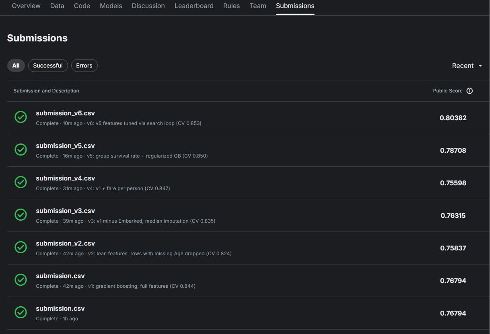

# Titanic: From 0.768 to 0.804 by Measuring My Mistakes

**A Kaggle case study in experimental discipline — 6 model versions, 4 failed experiments, and why the failures were the point.**

[Kaggle: Titanic — Machine Learning from Disaster](https://www.kaggle.com/c/titanic) · Final public leaderboard score: **0.80382** (~top 5–7% of honest submissions)

---

## The Result



| Version | Hypothesis | CV score | Leaderboard | Verdict |
|---|---|---|---|---|
| [v1](titanic.ipynb) | Solid baseline: EDA, title/family features, 3-model comparison | 0.844 | 0.76794 | Baseline |
| [v2](titanic_v2.ipynb) | "Weak columns skew the model — drop them; delete rows with missing Age" | 0.824 | 0.75837 | ❌ Refuted |
| [v3](titanic_v3.ipynb) | "Fine — drop only the single weakest column (Embarked)" | 0.835 | 0.76315 | ❌ Refuted |
| [v4](titanic_v4.ipynb) | "Add a clever ratio: fare per person" | 0.847 | 0.75598 | ❌ CV up, reality down |
| [v5](titanic_v5.ipynb) | "Add genuinely NEW information: did your travel group survive?" | 0.850 | 0.78708 | ✅ +1.9 pts |
| [v6](titanic_v6.ipynb) | "Tune with a persistent random-search loop + regularization" | 0.853 | **0.80382** | ✅ +1.7 pts |

Four of six experiments failed. Each was run as a controlled comparison — one change at a time, measured by 5-fold cross-validation against the previous version — so every failure produced a transferable lesson rather than just a worse number.

## What the Failures Taught

1. **Feature removal almost never helps tree models** (v2, v3). Even the weakest feature by solo-predictive-power (Embarked, 0.636 vs 0.616 baseline) contributed in combination. Trees ignore useless columns on their own; "weak" and "useless" are different claims.
2. **Impute rows, never delete them** (v2). The 177 passengers with missing Age were a biased sample (skewed 3rd class); deleting them removed signal, not noise. Missingness itself was predictive — `HasCabin` (whether a cabin was recorded) was the 3rd-strongest solo feature.
3. **New packaging of old information invites overfitting** (v4). Fare-per-person raised CV (+0.4) while dropping the leaderboard (−1.2). A validation gain paired with a real-world loss is a warning sign, not noise to explain away.
4. **The public leaderboard is ~209 rows** — differences under ~1 point are 2–3 passengers. Model selection ran on cross-validation; the leaderboard served as a sanity check only.

## What Actually Worked

- **Group survival rate** (v5, biggest single gain): passengers sharing a surname + ticket lived or died together. Built **leakage-safe** — each passenger's feature uses only the *other* group members' outcomes, never their own.
- **Regularization everywhere** (v5–v6): the tuned winner used the slowest learning rate in the search space (0.01), 60% row subsampling, and minimum leaf sizes. On 891 rows, discipline beats power.
- **Persistent search** (v6): the best hyperparameter configuration appeared at iteration 19 of 40 — after 11 consecutive non-improvements. Early stopping on "no progress" would have missed it.

## Side Investigations

The repo's history also includes smaller experiments documented in [LESSONS.md](LESSONS.md):
- **Single-feature strength ≠ marginal value**: Age alone barely beat baseline (0.630) yet was critical in combination; the five weakest features *combined* (0.686) beat the strongest traditional feature alone.
- **Probability matching loses**: assigning per-class survival *probabilities* (e.g. 63/47/24%) and predicting randomly always loses to deterministic majority predictions under accuracy — but is exactly optimal under log loss. Which strategy is "right" depends on the metric, and accuracy is not a proper scoring rule.
- **Interaction features must match the model**: hand-built categorical crosses (Sex×Class) helped only the linear model — trees build those internally. Ratios (Fare÷FamilySize) helped only the trees — splits can't do division.

## Repo Guide

| File | Contents |
|---|---|
| `titanic.ipynb` … `titanic_v6.ipynb` | The six versions, each executed with results and version-history table |
| `submission*.csv` | Corresponding Kaggle submissions |
| [LESSONS.md](LESSONS.md) | Full write-up: all terminology in plain language + mistakes→lessons |

**Data** is not included (competition rules); download with:

```python
import kagglehub
path = kagglehub.competition_download('titanic')  # copy contents to ./data/
```

## On the 1.00 Scores

The Titanic's complete casualty list is public history; leaderboard scores above ~0.83 are lookups, not models. The honest ceiling is ~0.80–0.81 — survival had genuine randomness no feature can capture. This project treats that ceiling as part of the lesson: knowing when a dataset is exhausted is itself an analytical skill.
